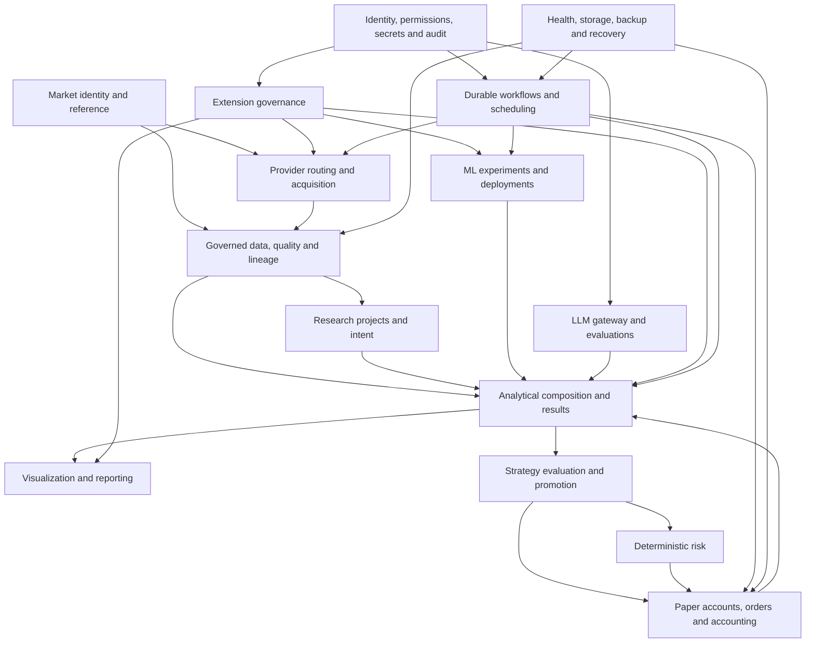

# OSCA Conceptual Domain Model

- **Status:** Draft
- **Governing role:** Architecture authority
- **Approval roles:** Product authority and quality authority
- **Purpose:** Define the principal OSCA domain concepts, semantic ownership candidates, invariants, and relationships used to derive capability modules and specifications.
- **Authoritative sources:** PRD sections 8–15, 18–32, and 34; decisions D-004–D-005, D-009, D-012–D-020, D-023–D-030, D-036–D-043; ADR-0002; OSCA glossary
- **Downstream consumers:** Requirements catalog, module catalog, dependency rules, public seams, schemas, specifications, tests, migration design, and documentation
- **Review triggers:** Glossary change, product-decision change, module ownership decision, newly discovered invariant, or implementation evidence that contradicts a relationship

## Model purpose and limits

This is a conceptual domain model. It identifies business meaning and lifecycle relationships before implementation technology is selected.

It is not:

- a persistence schema;
- a class hierarchy;
- an API payload specification;
- a decision to use event sourcing globally;
- a decision that every concept is a separate aggregate or table;
- an approved final module catalog.

Concepts may have distinct representations in different capability modules. Duplicate representations are acceptable when they preserve ownership and are synchronized through explicit contracts. Shared mutable models are not.

## Domain landscape

Arrows indicate required semantic collaboration, not package dependencies. The module dependency model may introduce application contracts, events, queries, or replicated read models to avoid cycles.

## Market identity and reference concepts

| Concept | Meaning and key invariants |
|---|---|
| **AssetClass** | Defines material market and lifecycle semantics. Adding an instrument within a supported class is configuration; adding a class may introduce new domain behavior. |
| **Asset** | Underlying security, fund, token, or currency-like economic object. Its identity is not a ticker. |
| **Venue** | Exchange or market context relevant to listing identity, sessions, calendars, and provider mappings. |
| **Instrument** | Stable provider-neutral analyzable or tradable identity with asset-class, currency, lifecycle, venue, or pair semantics as applicable. Historical identity is never overwritten by symbol reuse or lifecycle change. |
| **Listing** | Venue-specific representation of a security or fund instrument. |
| **TradingPair** | Base-asset and quote-asset spot market identity, with venue context where required. |
| **ProviderMapping** | Time-aware association between canonical identity and provider identifier in an explicit provider, dataset, and venue scope. Ambiguous mappings cannot silently normalize data. |
| **InstrumentCapability** | Declared availability of quotes, bars, fundamentals, news, corporate actions, or other data for a canonical instrument through a provider. |
| **MarketCalendar** | Versioned sessions, holidays, timezone, and daylight-saving semantics. |
| **InstrumentLifecycleEvent** | Split, merger, delisting, symbol change, migration, fork, redenomination, or analogous event with effective and information-availability times. |
| **UniverseDefinition** | Reproducibly defined instrument set used by research, analysis, models, strategies, or risk policy. |
| **Watchlist** | Owner-managed attention set that may influence monitoring or retrieval priority but is not automatically a reproducible research universe. |

### Identity invariants

- Provider symbol, ticker, pair notation, filename, and database key are not canonical economic identity.
- Provider mappings are scoped and time-aware.
- Lifecycle changes create history, not replacement of prior identity.
- Instrument semantics do not assume US domicile or USD denomination.
- Venue and provider are distinct concepts.

## Provider routing and acquisition concepts

| Concept | Meaning and key invariants |
|---|---|
| **ProviderDefinition** | Identity, adapter compatibility, policy metadata, and available capability declarations for one provider integration. |
| **ProviderCapability** | Machine-readable support and limitation statement covering category, instruments, intervals, history, freshness, timestamps, authentication, quotas, licensing, quality, cost, and health. |
| **RoutingPolicy** | Ordered capability-specific provider selection rules. A route is not a single global provider preference. |
| **ProviderSelection** | The resolved provider choice for one data requirement, including rationale and policy version. |
| **FallbackEvent** | Explicit provenance showing that a lower-priority route was used. It cannot silently merge series. |
| **DataRequirement** | Structured caller need covering scope, capability, interval, range, completion, freshness, quality, provider, adjustment, partiality, network, and waiting policy. |
| **RetrievalRequestIdentity** | Canonical identity used to deduplicate equivalent acquisition work independently of transient transport requests. |
| **RetrievalJob** | Durable idempotent acquisition or targeted-repair execution with progress, retry, quota, diagnostics, and lineage. |
| **ProviderResponse** | Untrusted external payload plus transport and response metadata. Retention depends on policy and licensing. |
| **ReconciliationDefinition** | Versioned deterministic method for comparing or explicitly resolving differences among identified datasets or provider segments. |

### Acquisition invariants

- Equivalent concurrent work resolves to one logical retrieval job where safe.
- Provider selection and fallback are reproducible provenance.
- Quota, licensing, persistence, and redistribution rules are enforced centrally enough to prevent bypass.
- Provider comparison produces findings; it does not automatically establish truth.
- Network or provider failure produces structured partial, stale, blocked, or unavailable behavior rather than silent substitution.

## Governed data, quality, storage, and lineage concepts

| Concept | Meaning and key invariants |
|---|---|
| **SourceRecord** | Immutable retained provider payload or faithful snapshot plus request identity, retrieval metadata, checksum, parser compatibility, and policy restrictions. Absence due to policy is recorded explicitly. |
| **Dataset** | Stable typed governed collection identity. |
| **DatasetRevision** | Immutable identifiable state of a dataset. Corrections, source revisions, parsing, normalization, repair, and transformation changes create new revisions. |
| **Observation** | Canonical measured or retrieved fact with instrument scope, effective time, units, currency, quality, freshness, and provenance. |
| **BarObservation** | Interval OHLCV observation with source interval, timestamp semantics, completion state, calendar, and revision. |
| **DerivedDataset** | Reproducible transformation result referencing exact definition, version, parameters, and upstream revisions. |
| **Artifact** | Typed durable output with stable identity, schema, producing workflow, configuration, inputs, code or build version, model or prompt identity, integrity, and lifecycle. |
| **LineageEdge** | Typed upstream or downstream dependency relationship among datasets, transformations, artifacts, runs, definitions, and decisions. |
| **QualityRule** | Versioned context-aware validation rule with declared applicability. |
| **QualityFinding** | Structured result with severity, scope, evidence, impact, and remediation. |
| **RepairDefinition** | Deterministic versioned transformation that produces a new revision and retains original data and impact lineage. |
| **AvailabilityState** | Structured state including available, evicted, expired, invalid, corrupt, partial, or reproducible. |
| **StorageClass** | Protected, canonical, source, derived, or ephemeral lifecycle classification. |
| **RetentionPolicy** | Versioned value-aware rules considering class, interval, age, recomputation cost, provider availability, dependencies, and pinning. |
| **StorageLocation** | Configurable physical root or adapter target whose relocation requires integrity verification and safe activation. |
| **IntegrityRecord** | Checksum or authenticity metadata used to detect corruption or substitution. |

### Data invariants

- Source records are never silently modified.
- Canonical corrections create revisions rather than rewriting retained analytical history.
- Derived results and artifacts identify exact inputs and producing definitions.
- Catalog metadata and lineage survive payload eviction.
- Cleanup previews downstream impact and cannot automatically delete protected content.
- Original data, repair transformation, revised data, and affected outputs remain traceable.
- Freshness, validity, quality, and availability are separate dimensions.

## Research organization concepts

| Concept | Meaning and key invariants |
|---|---|
| **GlobalCatalogEntry** | Reusable installation-level resource such as an instrument, provider policy, governed dataset, extension, template, promoted model, schedule, or security policy. |
| **ResearchProject** | Governed objective-specific container that owns research intent, hypotheses, project defaults, dependency pins, durable analyses, model experiments, findings, reports, and reproducibility manifests. |
| **AdHocWorkspace** | Identified temporary research context eligible for later promotion into a project. |
| **ResearchIntent** | Objective, motivation, horizon, assumptions, constraints, non-goals, and success criteria for an investigation. |
| **ResearchDecision** | Durable project-level choice and rationale, distinct from a product decision or ADR. |
| **Hypothesis** | Testable proposed relationship or expectation evaluated by project work. |
| **ProjectDependencyLock** | Exact provider, dataset, extension, environment, model, prompt, policy, or definition versions required for reproducibility. |
| **ReproducibilityManifest** | Consolidated exact dependencies and instructions needed to reproduce or explain project outputs. |
| **PromotionRecord** | Explicit movement of reusable content from project scope into a governed global use, or of a candidate into a later evaluation stage. |
| **ProjectTimelineEvent** | Decision, dataset revision, run, finding, promotion, outcome review, or other material project history. |

### Research invariants

- Every durable analysis, backtest, and report belongs to an explicit project.
- Project defaults may override system defaults but do not mutate global definitions.
- Projects reference immutable datasets and artifacts rather than silently following mutable aliases.
- LLM context is explicitly selected and cannot silently blend unrelated project histories.
- Reusable content is promoted deliberately with impact and compatibility analysis.

## Analytical composition and result concepts

| Concept | Meaning and key invariants |
|---|---|
| **CapabilityDefinition** | Versioned registered provider, metric, indicator, feature, label, analysis, strategy, model, or visualization capability with typed contracts and applicability. |
| **AnalysisDefinition** | Versioned inspectable dependency graph of capability nodes, inputs, parameters, methodology, and outputs. |
| **AnalysisNode** | One typed capability invocation inside an analysis graph. |
| **AnalysisRun** | Durable identified execution against exact definitions, inputs, policies, and versions. |
| **MetricResult** | Deterministic quantitative output with units, methodology, and applicability. |
| **Signal** | Method-specific interpretation of observations with scope, interval, horizon, direction or class, strength, method identity, and dependencies. |
| **Finding** | Structured conclusion preserving supporting and contradicting evidence, assumptions, quality, regime, risks, and provenance. |
| **Thesis** | Time-bounded testable analytical hypothesis with expected outcomes, invalidation conditions, and lifecycle state. |
| **Recommendation** | Optional proposed simulated action produced by an explicit recommendation policy and constrained by deterministic risk. |
| **Alert** | Notification-worthy analytical, quality, operational, security, thesis, recommendation, or risk occurrence. |
| **OutcomeEvaluation** | Later comparison of expected and realized outcomes, including horizon, availability, and calibration context. |
| **EvidenceReference** | Stable reference to governed observations, signals, findings, artifacts, or identified external sources supporting or contradicting a result. |

### Analytical invariants

- Observations, signals, findings, theses, recommendations, and alerts remain distinct types.
- Composite scores are optional explainable summaries, not complete outputs.
- Analysis graphs are inspectable and retain exact versions and dependencies.
- Missing optional data disables or degrades only dependent capabilities according to declared behavior.
- LLM narrative never replaces structured evidence or deterministic values.
- Outcome evaluation is linked back to the original horizon, evidence, model, and assumptions.

## Visualization and reporting concepts

| Concept | Meaning and key invariants |
|---|---|
| **VisualizationSpecification** | Typed versioned serializable declaration referencing governed results and reproduction metadata. |
| **VisualizationRenderer** | Application capability that turns a supported specification into interactive or static output without changing analytical truth. |
| **DashboardDefinition** | Saved composition of panels, filters, links, and interactions referencing results or reproducible queries. |
| **ReportDefinition** | Versioned arrangement of evidence, narrative, tables, and visualizations. |
| **RenderedReport** | Durable artifact produced from a report definition and exact inputs. |
| **ApproximationDisclosure** | Metadata describing downsampling, aggregation, or display approximation separately from analytical inputs. |
| **CustomViewDefinition** | Governed extension capability requiring additional compatibility, trust, permission, and state-access constraints. |

### Visualization invariants

- Standard visualizations do not query arbitrary private storage.
- Underlying data and reproduction metadata remain exportable subject to policy.
- Display approximations are disclosed and cannot silently replace full-resolution analysis.
- Accessibility is part of the contract, not a renderer-specific afterthought.
- LLM chart requests compile to validated specifications, not executable frontend code.

## Strategy evaluation, paper accounts, and risk concepts

| Concept | Meaning and key invariants |
|---|---|
| **StrategyDefinition** | Versioned method that produces decisions or typed order intents from governed inputs under declared timing and execution assumptions. |
| **RecommendationPolicy** | Versioned policy that converts eligible findings, theses, portfolio state, and constraints into a proposed simulated action. |
| **FidelityProfile** | Versioned F0, F1, F2, or F3 semantics and assumption contract. |
| **EvaluationRun** | Identified execution of a strategy or model under a fidelity profile and exact assumptions. |
| **PromotionPolicy** | Versioned criteria for moving a candidate into F2 validation or F3 paper evaluation. |
| **PromotionDecision** | Explicit approval, rejection, or deferral with evidence, policy version, rationale, and authority. |
| **OrderIntent** | Typed proposed simulated order before authoritative validation and risk evaluation. |
| **RiskPolicy** | Versioned deterministic constraints applied at system, account, portfolio, strategy, and order-intent scope. |
| **RiskDecision** | Structured approval, modification, rejection, or pause with rule identities, evidence, and explanations. |
| **PaperAccount** | Persistent simulated portfolio and accounting boundary with explicit base currency and independent project ownership. |
| **PaperOrder** | Accepted simulated order with immutable lifecycle history. |
| **OrderEvent** | Immutable creation, acceptance, rejection, partial-fill, fill, cancellation, expiration, or related decision event. |
| **FillEvent** | Simulated execution linked to market evidence, fill-model version, costs, and originating intent. |
| **JournalTransaction** | Balanced append-only accounting transaction representing one economic event. |
| **JournalEntry** | Debit or credit component of a balanced journal transaction. |
| **PortfolioProjection** | Rebuildable cash, position, lot, cost basis, exposure, performance, or risk read model. |
| **ValuationSnapshot** | Rebuildable valuation with exact price and FX sources, times, and revisions. |
| **ReconciliationResult** | Verification across orders, fills, corporate actions, journal, valuations, and projections. |
| **AutomationPause** | Account-level or system-wide state that prevents further paper actions while preserving history and reviewability. |

### Evaluation and accounting invariants

- Every result names its fidelity profile and assumption version.
- F1 is non-authoritative; F2 is authoritative initial historical execution validation; F3 is forward paper evaluation.
- Unsupported behavior is disclosed rather than approximated silently.
- Promotion to paper evaluation requires F2 validation and explicit decision.
- Models, LLMs, strategies, and extensions cannot approve exceptions to their own risk constraints.
- The strictest applicable deterministic risk constraint wins.
- Paper-order history is immutable.
- Every simulated economic event produces balanced append-only journal entries.
- Corrections use reversals and replacements.
- Portfolio state is a rebuildable projection, not independent accounting authority.
- Initial scope has no live order concept exposed through an executable application capability.

## ML lifecycle concepts

| Concept | Meaning and key invariants |
|---|---|
| **ExperimentDefinition** | Governed question, task, data, features, labels, partitions, evaluation, baselines, and search space. |
| **ExperimentRun** | One exact training or evaluation execution with environment, code, parameters, seed, hardware context, and outputs. |
| **ExperimentFamily** | Related candidate runs retained as a comparison and selection history. |
| **FeatureDefinition** | Versioned calculation and temporal-availability contract for a model input. |
| **LabelDefinition** | Versioned target construction, horizon, timing, and leakage contract. |
| **ModelVersion** | Immutable model artifact and identity with schema, training, evaluation, integrity, and provenance. |
| **ModelEvaluation** | Task-specific results against baselines, uncertainty, calibration, partitions, robustness, and promotion gates. |
| **ModelDeployment** | Reversible pointer from a scoped paper use to one exact model version and policy. |
| **ChampionDeployment** | Currently preferred scoped model deployment under monitoring. |
| **ChallengerDeployment** | Concurrent alternative evaluated under controlled comparison. |
| **DriftFinding** | Structured change in input, feature, prediction, calibration, outcome, regime, latency, or failure behavior. |

### ML invariants

- Feature and label timing prevent future information leakage.
- Model versions are immutable.
- Baselines and non-ML candidates are mandatory comparisons where applicable.
- Held-out data is not repeatedly reused for model selection.
- Retraining never implies promotion.
- Deployment rollback changes a pointer; it does not rewrite historical predictions or decisions.
- Reinforcement-learning outputs remain bounded by deterministic portfolio and risk rules.

## LLM lifecycle concepts

| Concept | Meaning and key invariants |
|---|---|
| **LLMProviderConfiguration** | Exact provider, model, endpoint, privacy, cost, latency, and capability configuration. |
| **PromptTemplate** | Versioned governed system and task instruction structure. |
| **ToolDefinition** | Versioned typed application capability schema exposed to an LLM. |
| **ContextSelectionPolicy** | Versioned rule selecting project and approved global context while excluding unrelated history. |
| **LLMWorkflowDefinition** | Versioned combination of prompts, retrieval, context, tools, schemas, model configuration, and budgets. |
| **LLMRun** | One identified execution retaining exact versions, context digest, permissions, tool calls, outputs, validation, cost, and latency. |
| **StructuredLLMOutput** | Schema-validated output classified as extraction, interpretation, recommendation, or generated hypothesis. |
| **LLMEvaluation** | Governed assessment of grounding, citations, numerical consistency, schemas, boundaries, injection resistance, tool correctness, task completion, cost, latency, and stability. |

### LLM invariants

- LLMs access narrow application tools, never internal databases.
- State-changing tools are distinct and require explicit policy or confirmation.
- No LLM tool can place a live order.
- External and extension content is untrusted data, not privileged instruction.
- Generated claims cite governed evidence or are labeled hypotheses.
- Provider or model upgrades cannot silently alter retained workflows.

## Extension-governance concepts

| Concept | Meaning and key invariants |
|---|---|
| **ExtensionIdentity** | Globally unique publisher and package identity independent of source location. |
| **ExtensionPackage** | Immutable distributable bundle and manifest with version, compatibility, schemas, dependencies, permissions, integrity, license, provenance, and resource behavior. |
| **PackageSourceReference** | Immutable Git reference, digest-pinned URL, local bundle identity, development directory, or registry identity used to obtain a package. |
| **InstallationRecord** | Exact package, source, digest, dependencies, trust tier, permissions, compatibility, and activation state in one installation. |
| **TrustTier** | Built-in, verified, local-trusted, or untrusted/quarantined treatment. |
| **PermissionDeclaration** | Capabilities requested by a package. |
| **PermissionGrant** | Owner-approved scoped capabilities actually available to an installed extension. |
| **ExtensionActivation** | Explicit enabling after validation and permission review. |
| **ExtensionContractVersion** | Public contract version governing compatibility and conformance. |
| **ConformanceResult** | Evidence that an extension satisfies input, output, error, provenance, determinism, resource, and isolation requirements. |
| **ImpactPreview** | Dependency and reproducibility consequences of activation, update, disablement, uninstall, or permission change. |

### Extension invariants

- Installation and activation are separate.
- Declared dependencies cannot silently install or activate themselves.
- Permission changes require renewed approval.
- Exact extension versions remain referenced by retained analyses and artifacts.
- Extensions never mutate canonical data directly.
- Extensions receive data and credentials only through approved contracts.
- Failure cannot corrupt unrelated workflows.
- Signature verifies identity and integrity, not unconditional safety.

## Durable workflow, operations, and recovery concepts

| Concept | Meaning and key invariants |
|---|---|
| **WorkflowDefinition** | Versioned durable process with typed inputs, outputs, dependencies, idempotency, concurrency, checkpoints, and resources. |
| **ScheduleDefinition** | Trigger, timezone or market-calendar semantics, missed-run policy, resource budget, and notification behavior. |
| **WorkflowRun** | Stable typed execution identity with state, progress, lineage, resources, diagnostics, and recovery behavior. |
| **RunCheckpoint** | Durable safe-resumption state whose semantics are owned by the workflow. |
| **MissedRunDecision** | Skip, run once, bounded catch-up, or require approval result. Financially meaningful paper actions are not silently replayed. |
| **HealthFinding** | Structured operational state, impact, evidence, affected resources, and remediation. |
| **AlertDeliveryAttempt** | One delivery attempt for an existing alert, separate from alert identity. |
| **AuditRecord** | Protected record of security, permission, governance, risk, recovery, or financially meaningful action. |
| **BackupProfile** | Lightweight, standard, archival, relaxed, standard-protection, or hardened selection and policy as applicable. |
| **RecoveryPoint** | Mutually consistent logical state across catalogs, journals, projects, deployments, locks, and dependencies. |
| **BackupSet** | Encrypted integrity-manifested compatibility-versioned package produced from a recovery point. |
| **RestorePlan** | Selected content, target location, migrations, conflict policy, degraded-mode conditions, and validation steps. |
| **RecoveryExercise** | Isolated recorded restore and verification execution. |

### Workflow and recovery invariants

- Workflow identities are typed; unrelated workflows do not share ambiguous latest-run state.
- Retries depend on error category and provider or quota semantics.
- Blocked work remains visible.
- Imported schedules remain disabled until reviewed.
- Recovery never silently replays financially meaningful paper actions.
- Backup package creation establishes a consistent logical point, not merely file-copy completion.
- Restore validates before activation.
- Recovery tests do not mutate the active environment.
- Paper automation remains paused until journal, required data, credentials, health, and risk controls reconcile.

## Ownership and translation rules

The final module catalog must assign one authoritative owner for each mutable concept and invariant. Likely ownership boundaries will be evaluated using:

- language cohesion;
- invariant and transaction cohesion;
- security and permission boundaries;
- change patterns;
- lifecycle and retention differences;
- failure isolation;
- performance and workload behavior;
- milestone sequencing;
- public extension-seam stability;
- recovery consistency requirements.

Cross-module representations must state:

- authoritative owner;
- consumer purpose;
- contract or event used;
- version and compatibility policy;
- freshness or consistency expectation;
- failure and replay behavior;
- lineage and audit requirements.

## Known modeling tensions requiring later specifications

These are not unresolved product questions, but they require detailed design before implementation:

- whether instrument reference, market calendars, and lifecycle events are one module or closely collaborating modules;
- whether the metadata catalog owns only lineage metadata or also coordinates lifecycle transitions across data layers;
- how research projects reference global resources while preserving immutable dependency pins;
- how analytical result ownership is divided between composition, execution, and result lifecycle;
- how strategy evaluation shares concepts with paper execution without creating cyclic ownership;
- how deterministic risk policy is shared across F2 and F3 while preserving account ownership;
- how model and extension registries collaborate when extensions supply training or inference capabilities;
- how backup establishes consistent recovery points across independently owned module state;
- which genuinely universal value types, if any, justify a minimal shared kernel.

Resolution of these tensions must follow accepted architecture principles and dependency rules and may require additional ADRs.
