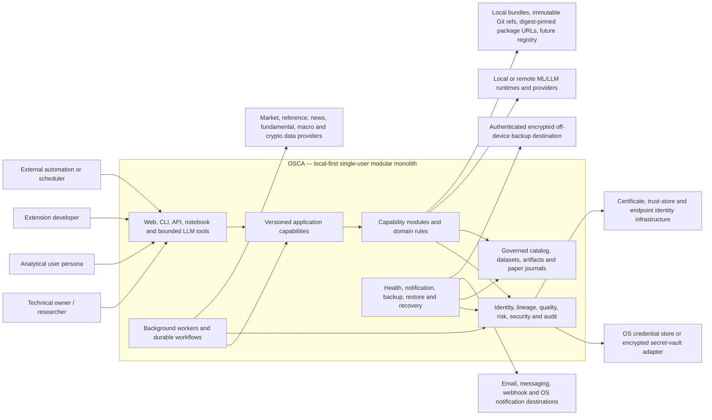

# OSCA System Context

- **Status:** Draft
- **Governing role:** Architecture authority
- **Approval roles:** Product authority and security authority
- **Purpose:** Define OSCA's system boundary, actors, external dependencies, deployment contexts, trust boundaries, and externally observable responsibilities without selecting an implementation stack.
- **Authoritative sources:** PRD sections 2–7, 12, 15–18, 25–29, 33–34, and 39; decisions D-001–D-008, D-016, D-019–D-023, D-030–D-036, D-040–D-041, D-044, D-046–D-047; ADR-0002
- **Downstream consumers:** Domain model, threat model, module catalog, interface specifications, deployment requirements, CI gates, and operational documentation
- **Review triggers:** Product-boundary change, new actor or external system, changed deployment mode, changed trust boundary, or new externally accessible capability

## System purpose

OSCA is a local-first market-intelligence and quantitative-research platform for one logical owner. It governs the lifecycle from market-data acquisition through validation, analysis, ML and LLM assistance, reproducible strategy evaluation, realistic paper trading, monitoring, outcome learning, and preservation.

OSCA is a research and decision-support system. It does not initially submit live brokerage or exchange orders, control real capital, provide custody, operate as a multi-tenant SaaS product, or synchronize independent installations.

## System boundary

Inside the OSCA product boundary are:

- versioned application capabilities shared by all clients;
- the web-primary interactive experience;
- CLI, API, notebook, and bounded LLM-tool interfaces;
- capability-oriented modules and their owned state;
- background workers and durable workflow execution;
- provider routing and acquisition coordination;
- governed source, canonical, derived, and artifact lifecycle behavior;
- metadata, identity, lineage, quality, licensing, retention, and availability governance;
- analytical composition and structured result lifecycles;
- strategy evaluation and paper-account behavior;
- ML and LLM lifecycle governance;
- extension installation, activation, permission, compatibility, and conformance behavior;
- deterministic security, risk, accounting, and validation enforcement;
- built-in health, telemetry, alerts, audit, backup, restore, and disaster-recovery behavior.

A physical implementation may use replaceable adapters, separate processes for safe execution, or optional workers, but those do not become independent product systems unless a later ADR changes the boundary.

## Context diagram

The analytical-user persona may be the same person as the owner. It is shown separately to preserve product-experience requirements from administrative and extension-development concerns.

## Human actors

### Logical owner

The owner:

- installs and configures OSCA;
- controls network exposure, providers, credentials, storage, budgets, security profiles, backup, and recovery;
- creates and governs research projects;
- approves extension activation and permissions;
- creates or approves paper accounts, strategies, recommendation policies, models, and schedules;
- reviews health, audit, risk, quality, and recovery posture;
- may delegate bounded automation through scoped credentials.

Initial owner authority does not imply that extensions, LLM tools, clients, or automation inherit unrestricted access. Internal capability enforcement remains mandatory.

### Technical individual investor or researcher

This primary persona:

- frames research intent and hypotheses;
- defines universes, data requirements, analyses, models, and strategies;
- inspects evidence, quality, assumptions, provenance, and contradictions;
- compares methods and fidelity profiles;
- promotes eligible candidates through explicit gates;
- evaluates forward paper outcomes.

### Analytical investor

This persona primarily consumes dashboards, reports, comparisons, explanations, alerts, and paper-portfolio state. Progressive disclosure may simplify interaction, but it cannot remove evidence, uncertainty, methodology, provenance, or risk semantics.

### Extension developer

The extension developer builds independently distributed provider, analytical, model, strategy, or visualization capabilities against governed public contracts. The developer receives no direct access to private module storage or unrestricted application internals.

### External automation operator

External automation invokes the same versioned application capabilities as interactive clients using scoped, revocable credentials. It cannot bypass validation, audit, risk, provenance, or durable-workflow semantics.

## External systems and dependencies

### Data providers

Data providers may supply instrument reference data, bars, quotes, corporate actions, fundamentals, estimates, news, macroeconomic data, or crypto-specific information. OSCA treats providers as replaceable, capability-specific dependencies with explicit authentication, quotas, licensing, quality, freshness, availability, and timestamp semantics.

Provider responses are untrusted external input. Selection, fallback, revisions, and reconciliation are visible in provenance. No provider silently becomes canonical authority merely because it is configured first.

### ML and LLM providers or runtimes

OSCA may invoke local or remote model runtimes. The provider-neutral gateway or model seam governs exact model identity, inputs, output schemas, privacy, resource budgets, evaluation, failure behavior, and provenance.

Model providers do not own deterministic financial calculations, risk enforcement, canonical data, accounting, or artifact identity.

### Credential store or secret vault

Provider and model credentials are held by an operating-system credential store or replaceable encrypted vault adapter. OSCA stores references and capability grants separately from secret values. Extensions and LLM tools cannot read the vault directly.

### Package sources

Extension packages may originate from local bundles, development directories, immutable Git references, digest-pinned URLs, and a future registry. Source availability does not imply trust, compatibility, permission, installation, or activation.

### Notification destinations

Notification adapters deliver alert content to configured destinations. Delivery failure does not erase the underlying alert or operational record. Sensitive content and licensing restrictions govern what may leave the installation.

### Off-device backup destination

At least one supported backup path can leave the active storage failure domain through authenticated encrypted transport. Backup destinations are not active OSCA peers and do not establish cross-installation synchronization.

### Trust and endpoint-identity infrastructure

Personal-server and controlled machine-to-machine operation depend on validated endpoint identity, trust stores, certificate lifecycle, scoped application credentials, and fail-closed transport behavior. OSCA must remain understandable in local mode without requiring external observability or identity SaaS services.

## Deployment contexts

### Workstation mode

- The default interactive context.
- Local interfaces bind to loopback or a protected local channel by default.
- The operating-system user boundary supplies the initial local identity boundary.
- Local model execution and cached offline research are supported where configured.
- Network access remains explicit and provider-specific.

### Personal-server mode

- One logical owner remains the tenancy boundary.
- Remote access requires authenticated sessions and encrypted authenticated transport.
- Headless CLI/API use and scheduled workflows are first-class.
- Security, certificate, backup, notification, resource, and health configuration become operational requirements.
- The software targets declared availability only while the host, storage, and required dependencies are healthy.

### Isolated recovery or verification mode

- Restore tests, migration validation, recovery exercises, and compatibility assessment operate against isolated storage.
- The active environment is not mutated.
- External side effects, especially paper actions and notifications, are disabled or redirected unless explicitly required by the test plan.

### Extension development and conformance mode

- Development packages may be loaded under explicit local-trusted or quarantined treatment.
- Conformance fixtures, permissions, resource budgets, compatibility, and failure isolation are testable before activation.
- Development convenience cannot grant access unavailable to the declared extension contract.

## Principal trust boundaries

| Boundary | Untrusted or lower-trust side | Required treatment |
|---|---|---|
| Human/client to application capability | Browser, CLI process, notebook, external automation, LLM caller | Authenticate where required; authorize by capability and scope; validate inputs; preserve audit and correlation identity. |
| OSCA to external provider | Market, data, model, news, package, notification, or backup endpoint | Authenticate endpoints and callers; validate schemas and content; enforce quotas, licensing, privacy, integrity, retries, and fail-closed transport. |
| Core modules to extension execution | Imported executable package and its dependencies | Verify identity and compatibility; separate installation from activation; enforce permissions, resource limits, contracts, provenance, and failure isolation. |
| Governed data to untrusted content processing | News, filings, web text, provider text, extension output | Treat as data rather than privileged instruction; prevent prompt or command injection; preserve source and policy metadata. |
| Secret vault to capability consumer | Modules, extensions, tools, workers, and clients | Expose named credential capabilities, never raw unrestricted vault access; redact outputs and diagnostics. |
| Active state to backup or restore environment | Backup destination, recovery package, isolated restore location | Encrypt, authenticate, integrity-check, version, preview, validate, reconcile, and activate only after required checks. |
| Module private state to other modules | Any non-owning module | Access only through published contracts or explicit replicated read models; prohibit private persistence access. |
| Deterministic authority to ML/LLM output | Predictions, generated narratives, recommendations | Schema-validate, label uncertainty, retain provenance, and prohibit replacement of authoritative calculations or policy enforcement. |

## Primary end-to-end flows

### Governed data flow

1. A client or workflow submits a structured data requirement.
2. OSCA resolves canonical instrument identities and applicable policies.
3. A capability-specific route selects a provider and records the decision.
4. A durable retrieval job acquires, validates, and records source material where permitted.
5. Normalization produces an immutable canonical dataset revision.
6. Quality rules produce explicit findings and may quarantine or block downstream use.
7. Derived transformations and artifacts retain exact lineage.
8. Storage and retention policies act with dependency-aware impact analysis.

### Research and analysis flow

1. The user creates or selects a research project and intent.
2. The project pins universe, data, quality, provider, extension, and environment assumptions.
3. An analysis definition composes registered capabilities as an inspectable graph.
4. A durable run resolves exact inputs and executes eligible work.
5. Results are emitted as typed observations, signals, findings, theses, recommendations, alerts, visualizations, or artifacts.
6. Dashboards and reports consume governed results and preserve reproduction metadata.
7. Outcome evaluation later connects expected and realized results.

### Strategy and paper-evaluation flow

1. A strategy or recommendation policy consumes governed evidence and exact assumptions.
2. F0 and F1 provide research evidence with explicit limitations.
3. Eligible candidates pass through F2 event-driven validation.
4. Promotion requires explicit policy and review; it is never automatic.
5. F3 paper evaluation uses forward data, deterministic risk, immutable order events, fills, and append-only accounting.
6. Reconciliation, monitoring, alerts, and backtest-versus-forward comparisons remain continuous.
7. No flow can emit a live brokerage or exchange order in initial scope.

### Extension flow

1. A package source is identified by immutable reference or expected digest.
2. OSCA validates manifest, integrity, compatibility, dependencies, trust tier, and declared permissions.
3. Installation creates an exact inactive installation record.
4. The owner reviews impact and grants named permissions.
5. Activation exposes only declared contracts.
6. Runs retain exact extension identity and version.
7. Upgrade, disablement, or uninstall previews reproducibility and dependency impact.

### Backup and recovery flow

1. A named profile selects required and optional content under security and licensing policy.
2. OSCA creates a consistent logical recovery point and integrity manifest.
3. The encrypted package is stored locally or transferred to an authenticated off-device destination.
4. Verification checks package integrity and periodically restores into isolated storage.
5. Restore previews compatibility, migrations, conflicts, unavailable payloads, and degraded operation.
6. Activation occurs only after required validation and reconciliation.

## Explicit exclusions from the context

The initial OSCA boundary contains no:

- live broker or exchange order submission;
- custody or movement of real funds;
- autonomous authority over real capital;
- multi-tenant identity, billing, organization, or collaboration system;
- synchronization protocol among independent installations;
- public strategy marketplace or social-trading network;
- mandatory cloud control plane;
- tick, quote, or order-book simulation presented as implemented fidelity;
- direct normal-workflow database interface for clients or extensions;
- service-per-module deployment assumption.

## Context invariants

- Every external interaction is attributable to an authenticated or explicitly local execution context.
- Every material external input is validated and retains source and policy context.
- Every material output is connected to exact inputs, versions, configuration, and execution identity.
- Deterministic components remain authoritative for financial calculations, accounting, backtesting, risk, quality, cache validity, and artifact identity.
- Remote and machine-to-machine transport fails closed when endpoint or caller identity cannot be validated.
- Provider, model, extension, and notification failures cannot silently corrupt unrelated capabilities.
- Personal-server operation changes transport and operational requirements, not the logical product or tenancy model.
- Future compatibility is preserved through contracts and ownership rather than speculative distributed architecture.
